# Stock Market Data Pipeline


> A production-grade, end-to-end data engineering pipeline that ingests real-time and historical stock market data via AlphaVantage, processes it through dual batch and streaming architectures using Apache Kafka, Apache Spark, and Apache Airflow, stores raw and processed data in MinIO (S3-compatible object storage), and loads daily stock metrics into Snowflake using incremental MERGE upserts — all containerised with Docker Compose.

---

## Table of Contents

- [Introduction](#introduction)
- [Architecture](#architecture)
- [Project Structure](#project-structure)
- [Prerequisites](#prerequisites)
- [Installation and Setup](#installation-and-setup)
- [Pipeline Workflow](#pipeline-workflow)
- [Deep Dive](#deep-dive)
  - [1. Kafka - Ingestion Layer](#1-kafka---ingestion-layer)
  - [2. Spark - Processing Layer](#2-spark---processing-layer)
  - [3. Airflow - Orchestration Layer](#3-airflow---orchestration-layer)
  - [4. Snowflake - Warehouse Layer](#4-snowflake---warehouse-layer)
- [Key Engineering Decisions](#key-engineering-decisions)

---

## Introduction

This project simulates a real-world financial data engineering platform. It ingests stock market data for 10 major equities (AAPL, MSFT, GOOGL, AMZN, META, TSLA, NVDA, INTC, JPM, V) and runs two independent pipelines in parallel:

- **Batch pipeline** - fetches historical daily OHLCV (Open, High, Low, Close, Volume) candles once per day via Airflow, processes them with Spark, and upserts the results into Snowflake for historical analysis.
- **Streaming pipeline** - continuously polls live price quotes, buffers them through Kafka, and computes rolling 15-minute and 1-hour moving averages using Spark Structured Streaming - serving as a real-time monitoring layer.

The entire stack runs locally via Docker Compose, making it reproducible on any machine without cloud infrastructure.

---

## Architecture

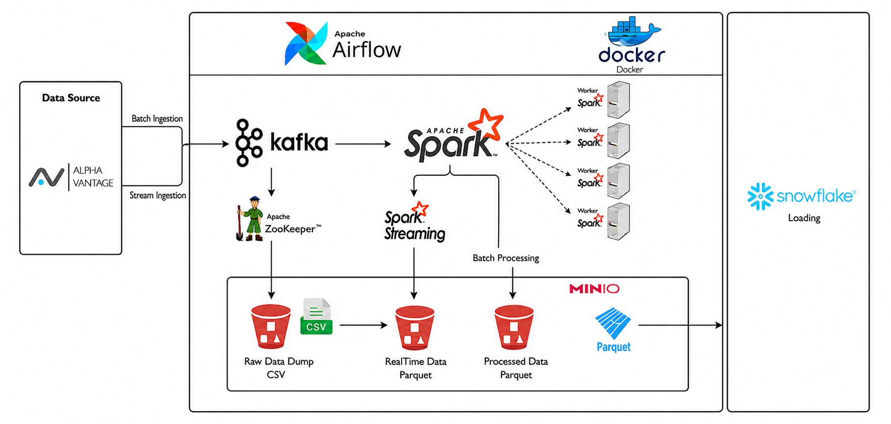

### Why this architecture?

**AlphaVantage as the data source** replaces the original random price simulator with real market data. The free tier (25 calls/day, 5 calls/minute) is respected via deliberate rate-limiting built into both producers - 12-second delays between API calls for the batch producer, and ~8-hour gaps between polling cycles for the stream producer.

**Kafka as the middle layer** decouples producers from consumers entirely. If the consumer crashes mid-run, it replays from its last committed Kafka offset - no data is lost and the AlphaVantage API is never called twice. This is the fundamental reason for Kafka's presence: fault tolerance and replay.

**Two separate Kafka topics** (`stock-market-batch` and `stock-market-realtime`) allow the batch and streaming pipelines to evolve independently with different consumer group configurations, retention policies, and processing semantics.

**MinIO as S3-compatible object storage** gives the pipeline a local data lake without requiring AWS credentials. It stores raw CSVs written by consumers and processed Parquet files written by Spark - two distinct layers with a clean separation.

**Spark for both batch and streaming** means a single processing engine handles both workloads. The batch processor computes daily OHLCV metrics; the stream processor computes sliding-window moving averages. Using Spark for both avoids introducing a second processing framework.

**Airflow for orchestration** manages the batch pipeline as a DAG with five sequential tasks and a daily schedule. The streaming pipeline runs as a long-lived independent process outside Airflow since streaming jobs are not suited to task-based DAG execution.

**Snowflake as the warehouse** receives clean, deduplicated daily metrics via a MERGE upsert strategy - so re-running the pipeline for the same date updates existing rows rather than inserting duplicates.

---

## Project Structure

```
STOCKMARKET_DATAPIPELINE/
│
├── src/
│   ├── airflow/
│   │   ├── dags/
│   │   │   ├── stock_market_batch_dag.py    # Airflow DAG definition
│   │   │   └── scripts/
│   │   │       ├── batch_data_producer.py   # AlphaVantage → Kafka (batch)
│   │   │       ├── batch_data_consumer.py   # Kafka → MinIO (batch)
│   │   │       └── load_to_snowflake.py     # MinIO → Snowflake
│   │   ├── logs/
│   │   ├── plugins/
│   │   └── requirements/
│   │
│   ├── kafka/
│   │   ├── producer/
│   │   │   ├── batch_data_producer.py       # AlphaVantage TIME_SERIES_DAILY
│   │   │   └── stream_data_producer.py      # AlphaVantage GLOBAL_QUOTE
│   │   └── consumer/
│   │       ├── batch_data_consumer.py       # Kafka → MinIO/raw/historical
│   │       └── realtime_data_consumer.py    # Kafka → MinIO/raw/realtime
│   │
│   ├── snowflake/
│   │   └── scripts/
│   │       └── load_to_snowflake.py         # Incremental MERGE load
│   │
│   └── spark/
│       └── jobs/
│           ├── spark_batch_processor.py     # Daily OHLCV metrics
│           └── spark_stream_processor.py    # Sliding window metrics
│
├── data/                                    # Docker volumes (gitignored)
│   ├── kafka/
│   ├── minio/
│   └── zookeeper/
│
├── docker-compose.yaml
├── requirements.txt
├── .env
└── README.md
```

---

## Prerequisites

| Tool | Version | Purpose |
|---|---|---|
| Docker | 20.10+ | Container runtime |
| Docker Compose | 2.0+ | Multi-container orchestration |
| Python | 3.10+ | Local script execution (optional) |
| AlphaVantage API key | Free tier | Stock data source |
| Snowflake account | Free trial works | Data warehouse |

---

## Installation and Setup

### 1. Clone the repository

```bash
git clone https://github.com/PrasunDutta007/Stock-Market-Datapipeline.git
cd Stock-Market-Datapipeline
```

### 2. Create & configure environment variables

```bash
touch .env
```

Open `.env` and fill in your credentials:

```bash
# AlphaVantage — get a free key at https://www.alphavantage.co/support/#api-key
ALPHA_VANTAGE_API_KEY=your_key_here

# Kafka
KAFKA_BOOTSTRAP_SERVERS="localhost:9092"
KAFKA_TOPIC_REALTIME="stock-market-realtime"
KAFKA_TOPIC_BATCH="stock-market-batch"
KAFKA_GROUP_ID="stock-market-consumer-group"
KAFKA_GROUP_BATCH_ID="stock-market-batch-consumer-group"
KAFKA_GROUP_REALTIME_ID="stock-market-realtime-consumer-group"

# MinIO (default credentials work out of the box)
MINIO_ACCESS_KEY="minioadmin"
MINIO_SECRET_KEY="minioadmin"
MINIO_BUCKET="stock-market-data"
MINIO_ENDPOINT="localhost:9000"
MINIO_CONNECTION="http://minio:9000"

# Snowflake
SNOWFLAKE_ACCOUNT=your_account_id
SNOWFLAKE_USER=your_username
SNOWFLAKE_PASSWORD=your_password
SNOWFLAKE_DATABASE="STOCKMARKETBATCH"
SNOWFLAKE_SCHEMA="PUBLIC"
SNOWFLAKE_WAREHOUSE="COMPUTE_WH"
SNOWFLAKE_TABLE="DAILY_STOCK_METRICS"
```

### 3. Start the stack

```bash
docker-compose up -d
```

This starts: PostgreSQL, Zookeeper, Kafka, MinIO, Spark (master + worker + client), and Airflow (webserver + scheduler + init).

### 4. Verify services are running

| Service | URL | Credentials |
|---|---|---|
| Airflow UI | http://localhost:8081 | airflow / airflow |
| MinIO Console | http://localhost:9001 | minioadmin / minioadmin |
| Spark Master UI | http://localhost:8080 | — |

### 5. Verify Kafka topics exist

```bash
docker-compose exec kafka kafka-topics --list --bootstrap-server localhost:9092
```

Expected output:
```
__consumer_offsets
stock-market-batch
stock-market-realtime
```

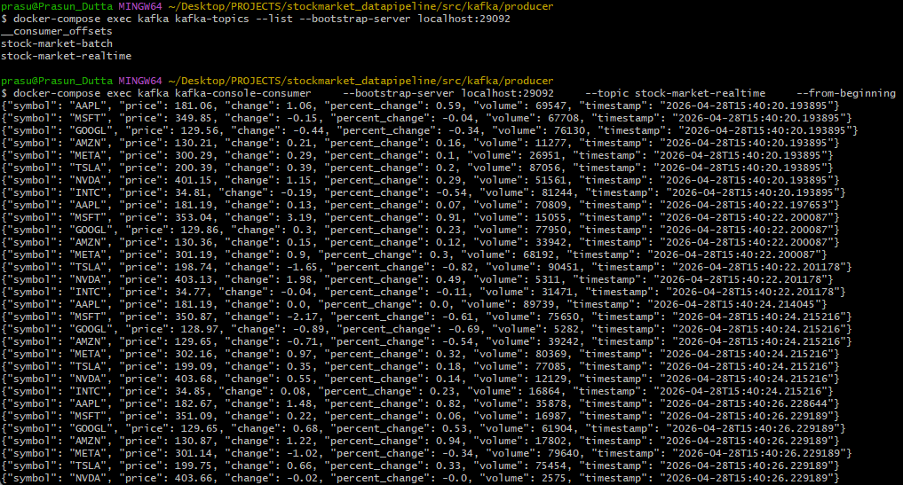

### 6. Copy scripts into Airflow DAGs folder

```bash
cp src/kafka/producer/batch_data_producer.py   src/airflow/dags/scripts/
cp src/kafka/consumer/batch_data_consumer.py   src/airflow/dags/scripts/
cp src/snowflake/scripts/load_to_snowflake.py  src/airflow/dags/scripts/
cp src/airflow/dags/stock_market_batch_dag.py  src/airflow/dags/
```

### 7. Trigger the batch pipeline

In the Airflow UI at http://localhost:8081, enable and manually trigger `stock_market_batch_pipeline`.

### 8. Run the streaming pipeline (separately)

```bash
# In one terminal — stream producer
cd src/kafka/producer
python stream_data_producer.py

# In another terminal — realtime consumer
cd src/kafka/consumer
python realtime_data_consumer.py
```

---

## Pipeline Workflow

```
┌─────────────────────────────────────────────────────────────────────┐
│                        BATCH PIPELINE (Airflow)                     │
│                                                                     │
│  AlphaVantage          Kafka              MinIO           Snowflake │
│  TIME_SERIES  ──────►  stock-market  ──►  raw/historical  ──────►   │
│  DAILY                 -batch             ↓                         │
│                                        Spark Batch                  │
│                                           ↓                         │
│                                        processed/historical         │
└─────────────────────────────────────────────────────────────────────┘

┌─────────────────────────────────────────────────────────────────────┐
│                    STREAMING PIPELINE (always-on)                   │
│                                                                     │
│  AlphaVantage          Kafka              MinIO                     │
│  GLOBAL_QUOTE ──────►  stock-market  ──►  raw/realtime              │
│                        -realtime          ↓                         │
│                                        Spark Streaming              │
│                                           ↓                         │
│                                        processed/realtime           │
│                                    (15min/1h rolling windows)       │
└─────────────────────────────────────────────────────────────────────┘
```

---

## Deep Dive

---

### 1. Kafka - Ingestion Layer

Kafka acts as the fault-tolerant message bus between data producers (AlphaVantage API callers) and data consumers (MinIO writers). If a consumer crashes, it replays from its last committed offset - no data is lost and no API call is repeated.

#### `batch_data_producer.py`

Calls AlphaVantage `TIME_SERIES_DAILY` once per stock and publishes historical OHLCV rows to the `stock-market-batch` topic.

**Key design decisions:**
- Uses `compact` outputsize (last 100 trading days) to minimise API quota consumption
- Filters the response to only the Airflow execution date (`{{ ds }}`) making each DAG run idempotent
- Falls back to the most recent available trading day if the execution date is a weekend or holiday
- Enforces a **12-second delay** between API calls to stay within the 5 calls/minute free-tier limit
- Calls `producer.flush()` before exiting — guaranteeing all messages are durably written to Kafka before the consumer task starts

```python
# Rate limit: 5 calls/minute → 12s between calls
if i < len(STOCKS) - 1:
    time.sleep(API_CALL_DELAY_SECONDS)
```

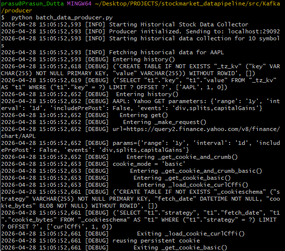

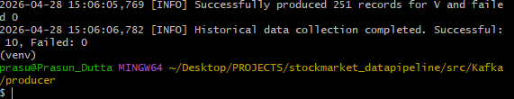

---

#### `stream_data_producer.py`

Calls AlphaVantage `GLOBAL_QUOTE` continuously, rotating through 8 stocks and publishing live price snapshots to the `stock-market-realtime` topic.

**Key design decisions:**
- Uses `GLOBAL_QUOTE` (not `TIME_SERIES_DAILY`) — the lightest, lowest-latency AlphaVantage endpoint
- Tracks previous prices internally to emit `change` and `percent_change` between polling cycles
- **Free-tier budget management**: 8 stocks × 1 call = 8 calls per cycle. With 25 calls/day budget → 3 full cycles/day maximum → ~8-hour gap enforced between cycles via `CYCLE_INTERVAL_SECONDS`

```python
CYCLES_PER_DAY = 3
CYCLE_INTERVAL_SECONDS = 86_400 // CYCLES_PER_DAY   # ~8 hours
```


---

#### `batch_data_consumer.py`

Reads from `stock-market-batch`, writes each message as a partitioned CSV to MinIO, and commits Kafka offsets only after a successful write.

**Key design decisions:**
- **Idle timeout exit** (`IDLE_TIMEOUT_SECONDS = 30`): exits after 30 seconds of no new messages so the Airflow BashOperator task can complete. Without this, the DAG hangs forever.
- **Manual offset commit**: `enable.auto.commit: False` with explicit `consumer.commit()` after each successful MinIO write - ensures no message is marked as consumed unless it is safely stored.
- **Safe temp file cleanup**: `csv_file.unlink()` runs in a `finally` block, separate from the commit - a failed cleanup cannot prevent the offset from being committed.

```
MinIO path: raw/historical/year=YYYY/month=MM/day=DD/{SYMBOL}_{timestamp}.csv
```

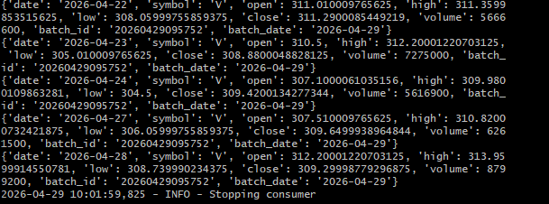

---

#### `realtime_data_consumer.py`

Reads from `stock-market-realtime`, buffers messages in memory, and flushes to MinIO as a single CSV when either 100 messages accumulate or 60 seconds elapse.

**Key design decisions:**
- **Conditional buffer flush**: buffer and Kafka offsets are only reset on a **successful** MinIO write. If the S3 write fails, messages are retained for the next flush cycle — preventing silent data loss.
- **Graceful shutdown flush**: on `KeyboardInterrupt`, any remaining buffered messages are flushed to MinIO before the consumer closes.
- **Hour-level partitioning** makes data queryable by time window for Spark Structured Streaming.

```
MinIO path: raw/realtime/year=YYYY/month=MM/day=DD/hour=HH/stock_data_{timestamp}.csv
```


---

### 2. Spark - Processing Layer

#### `spark_batch_processor.py`

Reads raw CSV files from `MinIO/raw/historical/` for the given execution date, computes daily OHLCV metrics using window functions, and writes Parquet output to `MinIO/processed/historical/`.

**Key components:**

**Window functions for daily aggregation:**
```python
window_day = Window.partitionBy("symbol", "date")

df = df.withColumn("daily_open",   F.first("open").over(window_day))
df = df.withColumn("daily_high",   F.max("high").over(window_day))
df = df.withColumn("daily_low",    F.min("low").over(window_day))
df = df.withColumn("daily_volume", F.sum("volume").over(window_day))
df = df.withColumn("daily_close",  F.last("close").over(window_day))
df = df.withColumn("daily_change",
    (F.col("daily_close") - F.col("daily_open")) / F.col("daily_open") * 100)
```

**S3A configuration for MinIO:**
```python
spark_conf.set("fs.s3a.endpoint",          "http://minio:9000")
spark_conf.set("fs.s3a.path.style.access", "true")
spark_conf.set("fs.s3a.impl",              "org.apache.hadoop.fs.s3a.S3AFileSystem")
```

**Output — `inferSchema=True` vs without:**

Without `inferSchema`, Spark reads all columns as strings — unusable for numeric aggregations:

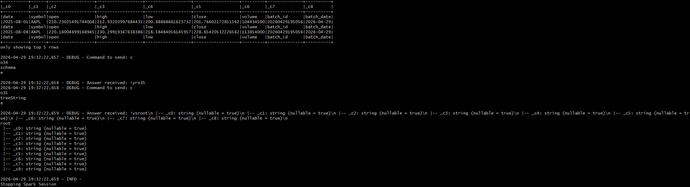

With `inferSchema=True`, Spark correctly infers numeric types — window aggregations work correctly:

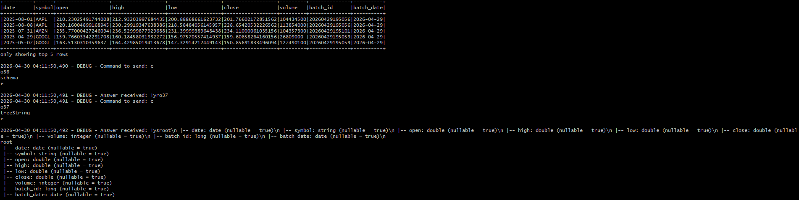

**Processed output — daily OHLCV metrics in Spark:**

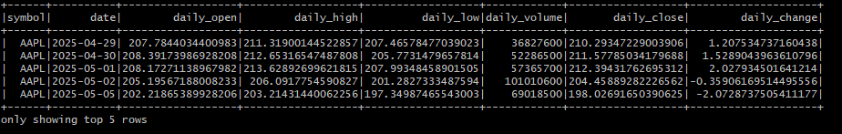

**Processed Parquet files in MinIO — partitioned by symbol:**

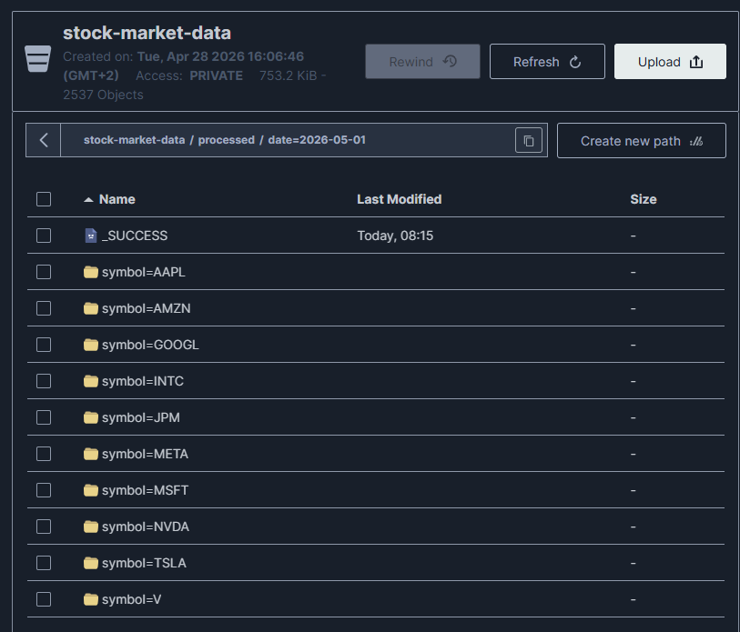

---

#### `spark_stream_processor.py`

Reads CSV files from `MinIO/raw/realtime/` as a Spark Structured Streaming source and computes rolling window metrics.

**Key components:**

**Watermark for late data handling:**
```python
streaming_df = streaming_df.withWatermark("timestamp", "5 minutes")
```

**Sliding window aggregations:**
```python
# 15-minute window, sliding every 5 minutes
window_15min = F.window("timestamp", "15 minutes", "5 minutes")

df_15min = streaming_df.groupBy("symbol", window_15min).agg(
    F.avg("price").alias("ma_15m"),
    F.stddev("price").alias("volatility_15m"),
    F.sum("volume").alias("volume_sum_15m")
)

# 1-hour window, sliding every 10 minutes
window_1h = F.window("timestamp", "1 hour", "10 minutes")
```

**Checkpoint location** for exactly-once guarantees:
```python
checkpoint_path = f"s3a://{MINIO_BUCKET}/checkpoints/streaming_processor"
```

---

### 3. Airflow - Orchestration Layer

#### `stock_market_batch_dag.py`

Defines the five-task DAG that orchestrates the entire batch pipeline on a daily schedule.

```python
fetch_historical_data >> consume_historical_data >> process_data >> load_to_snowflake >> process_complete
```

| Task | Script | What it does |
|---|---|---|
| `fetch_historical_data` | `batch_data_producer.py` | Calls AlphaVantage, publishes 10 messages to Kafka |
| `consume_historical_data` | `batch_data_consumer.py` | Reads Kafka, writes 10 CSVs to MinIO |
| `process_data` | `spark_batch_processor.py` | Reads CSVs, writes Parquet via `docker exec spark-master spark-submit` |
| `load_historical_to_snowflake` | `load_to_snowflake.py` | Reads Parquet, upserts into Snowflake |
| `process_complete` | inline echo | Marks the pipeline complete |

**All five tasks succeeding:**

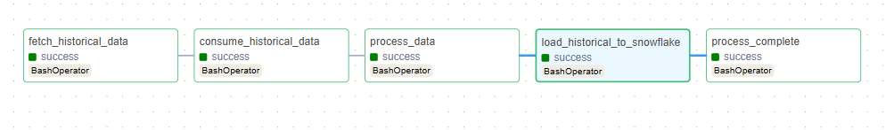

**DAG run history and duration:**

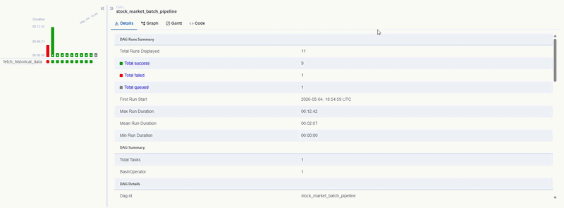

**Important DAG configuration:**
```python
dag = DAG(
    "stock_market_batch_pipeline",
    schedule_interval=timedelta(days=1),
    start_date=datetime(2026, 4, 1),
    catchup=False,          # prevents backfilling all missed runs
    default_args={
        "retries": 1,
        "retry_delay": timedelta(minutes=5),
    }
)
```

`catchup=False` is critical - without it, Airflow would attempt to run the DAG for every day since `start_date`, exhausting the 25 AlphaVantage API calls in the first run.

---

### 4. Snowflake - Warehouse Layer

#### `load_to_snowflake.py`

Reads processed Parquet files from MinIO for the execution date and upserts them into `DAILY_STOCK_METRICS` using a three-step MERGE strategy.

**Three-step upsert strategy:**

```
Step 1: CREATE TEMPORARY TABLE TEMP_DAILY_STOCK_STAGE LIKE DAILY_STOCK_METRICS
Step 2: write_pandas() → PUT + COPY INTO staging table   (bulk load, not row-by-row)
Step 3: MERGE INTO target USING staging ON (symbol, date)
          WHEN MATCHED    → UPDATE all metric columns
          WHEN NOT MATCHED → INSERT new row
```

**Why `write_pandas` instead of `executemany`:**

`write_pandas` from `snowflake.connector.pandas_tools` uses Snowflake's internal PUT/COPY path — it compresses the DataFrame into a Parquet file, uploads it to Snowflake's internal stage, and issues a bulk `COPY INTO`. This is orders of magnitude faster than row-by-row `executemany` inserts for any real volume.

**Symbol extraction from Spark partition paths:**

Spark's `.partitionBy("symbol")` physically removes the `symbol` column from the Parquet file and encodes it only in the directory name (`symbol=AAPL/`). The loader extracts it from the S3 key:

```python
for segment in key.split("/"):
    if segment.startswith("symbol="):
        symbol = segment.split("=", 1)[-1]
        break
df["symbol"] = symbol   # inject back as a column
```

**Snowflake table — 86 rows of AAPL daily metrics loaded:**

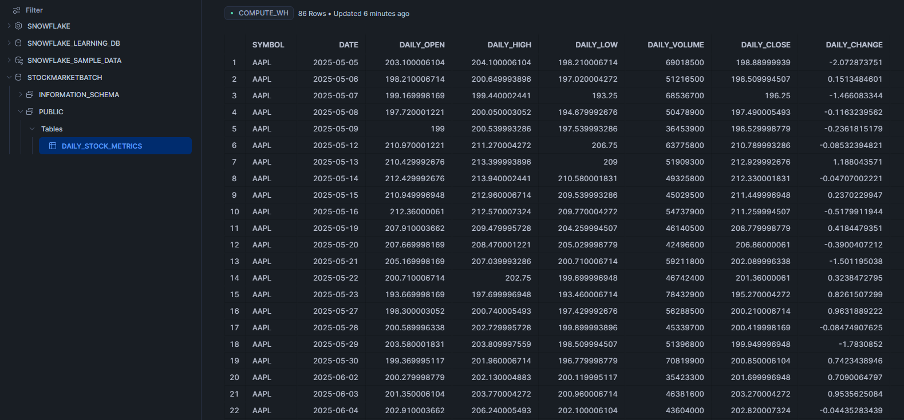

**Table schema:**
```sql
CREATE TABLE IF NOT EXISTS STOCKMARKETBATCH.PUBLIC.DAILY_STOCK_METRICS (
    symbol       STRING    NOT NULL,
    date         DATE      NOT NULL,
    daily_open   FLOAT,
    daily_high   FLOAT,
    daily_low    FLOAT,
    daily_volume FLOAT,
    daily_close  FLOAT,
    daily_change FLOAT,
    last_updated TIMESTAMP,
    PRIMARY KEY (symbol, date)   -- metadata only, enforced by MERGE logic
)
```


---

## Key Engineering Decisions

| Decision | Rationale |
|---|---|
| AlphaVantage over yfinance | Real API with rate limits simulates production constraints; yfinance is unofficial and unreliable |
| Kafka between producer and consumer | Fault tolerance and replay — consumer can crash and recover without re-calling the API |
| Manual Kafka offset commit | Ensures exactly-once delivery semantics — offsets only advance after data is safely in MinIO |
| `write_pandas` over `executemany` | PUT/COPY is Snowflake's native bulk load path — orders of magnitude faster than row-by-row inserts |
| MERGE upsert strategy | Re-running the pipeline for the same date updates rows rather than duplicating them |
| `pd.Timestamp.now()` over `datetime.now()` | Produces `datetime64[ns]` dtype that Parquet serialises correctly into Snowflake TIMESTAMP |
| Streaming pipeline outside Airflow | Streaming jobs run indefinitely — BashOperator tasks must terminate; the two models are incompatible |
| `catchup=False` in DAG | Prevents Airflow from backfilling every day since `start_date`, which would exhaust the API quota |
| Docker service names in container config | `kafka:9092`, `minio:9000` — not `localhost` — because containers resolve hostnames via Docker's internal DNS |

---

*Built by Prasun Dutta*

---


